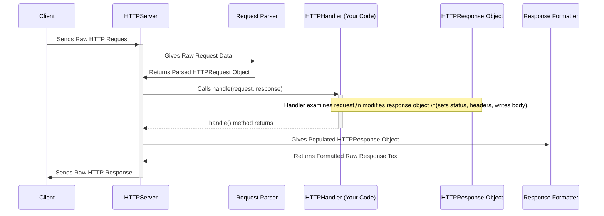

# Chapter 2: HTTPHandler

Welcome back! In [Chapter 1: HTTPRequest & HTTPResponse](01_httprequest___httpresponse_.md), we learned about the "order ticket" (`HTTPRequest`) the client sends and the "prepared meal" (`HTTPResponse`) the server sends back. But who actually takes the order ticket, prepares the meal, and puts it on the tray? That's the job of the `HTTPHandler`.

## The Chef in the Kitchen: What is `HTTPHandler`?

Imagine our web server is like a restaurant. The `HTTPServer` is the front-of-house manager who receives the customer's order (`HTTPRequest`). But the manager doesn't cook the food! They hand the order ticket over to the **chef** in the kitchen.

The `HTTPHandler` is our **chef**. It's where *your* application logic lives. Its job is to:

1.  Look at the `HTTPRequest` (the order ticket) to see what the client wants.
2.  Do the necessary work (like fetching data, performing calculations, or just deciding what to say). This is like preparing the food.
3.  Put the result into the `HTTPResponse` object (placing the meal on the tray).

In technical terms, `HTTPHandler` is a Java **interface**. An interface is like a contract – it defines *what* needs to be done, but not *how*. It has just one method you need to implement:

```java
// From: main/java/io/fusionauth/http/server/HTTPHandler.java

@FunctionalInterface // This means it has only one abstract method
public interface HTTPHandler {
  /**
   * Handles the request and populates the response.
   *
   * @param request  The incoming request (read-only).
   * @param response The outgoing response (you modify this).
   * @throws Exception If something goes wrong.
   */
  void handle(HTTPRequest request, HTTPResponse response) throws Exception;
}
```

Your job, as the application developer using the `src` library, is to provide the *implementation* of this `handle` method. This implementation contains the specific steps your application should take for each incoming request.

## Use Case: Saying "Hello!"

Let's start with the simplest possible task: creating a handler that just sends back "Hello, World!" to any request.

Here's how you could implement an `HTTPHandler` for this:

```java
import io.fusionauth.http.server.HTTPHandler;
import io.fusionauth.http.server.HTTPRequest;
import io.fusionauth.http.server.HTTPResponse;
import java.io.OutputStream;
import java.nio.charset.StandardCharsets;

// This is OUR implementation of the HTTPHandler interface
public class HelloWorldHandler implements HTTPHandler {

    @Override
    public void handle(HTTPRequest request, HTTPResponse response) throws Exception {
        // 1. Set the status code to 200 OK (Success!)
        response.setStatus(200);

        // 2. Tell the browser we're sending plain text
        response.setHeader("Content-Type", "text/plain");

        // 3. Get the "tray" (OutputStream) to put our response body on
        //    Using try-with-resources ensures the stream is closed properly
        try (OutputStream outputStream = response.getOutputStream()) {
            // 4. Prepare the "meal" (our message as bytes)
            byte[] body = "Hello, World!".getBytes(StandardCharsets.UTF_8);

            // 5. Put the meal on the tray (write bytes to the stream)
            outputStream.write(body);
        }
        // That's it! The server will now send this response back.
    }
}
```

Let's break down what this code does:

1.  `response.setStatus(200);`: We tell the `HTTPResponse` object that the request was successful (`200 OK`).
2.  `response.setHeader("Content-Type", "text/plain");`: We add a header to tell the client (like a browser) that the body of our response is just plain text, not HTML or JSON.
3.  `try (OutputStream outputStream = response.getOutputStream())`: We get access to the response's *output stream*. Think of this as the actual tray we place the food onto. We use a `try-with-resources` block, which is a standard Java way to make sure the stream is properly closed after we're done writing to it. This is handled by the [HTTP I/O Streams (Input & Output)](06_http_i_o_streams__input___output__.md).
4.  `byte[] body = "Hello, World!".getBytes(StandardCharsets.UTF_8);`: We convert our "Hello, World!" string into raw bytes using the standard UTF-8 encoding. Computers send text over the network as bytes.
5.  `outputStream.write(body);`: We write these bytes into the output stream. Our response body is now ready.

When the `handle` method finishes, the [HTTPServer](04_httpserver_.md) takes the populated `HTTPResponse` object and sends it back to the client.

## A Slightly More Advanced Chef: Using Request Info

What if we want our response to depend on the request? Let's make a handler that says "Hello, \[Name\]!", where the name comes from a URL parameter like `/greet?name=Alice`.

We'll need to look inside the `HTTPRequest` object passed to our `handle` method.

```java
import io.fusionauth.http.server.HTTPHandler;
import io.fusionauth.http.server.HTTPRequest;
import io.fusionauth.http.server.HTTPResponse;
import java.io.OutputStream;
import java.nio.charset.StandardCharsets;
import java.util.List;

public class GreeterHandler implements HTTPHandler {

    @Override
    public void handle(HTTPRequest request, HTTPResponse response) throws Exception {
        // 1. Look for the 'name' parameter in the URL query string
        //    e.g., /greet?name=Alice -> urlParameters map contains {"name": ["Alice"]}
        String name = "World"; // Default name
        List<String> names = request.getURLParameters().get("name");
        if (names != null && !names.isEmpty()) {
            name = names.get(0); // Use the first 'name' parameter if provided
        }

        // 2. Prepare the greeting message
        String message = "Hello, " + name + "!";
        byte[] body = message.getBytes(StandardCharsets.UTF_8);

        // 3. Set status and headers (same as before, but could be different)
        response.setStatus(200);
        response.setHeader("Content-Type", "text/plain");
        // We should also set the Content-Length header for efficiency
        response.setHeader("Content-Length", String.valueOf(body.length));

        // 4. Write the body to the output stream
        try (OutputStream outputStream = response.getOutputStream()) {
            outputStream.write(body);
        }
    }
}
```

What changed?

1.  `request.getURLParameters().get("name")`: We accessed the `HTTPRequest` object (`request`) and asked for its URL parameters (parsed from the part after the `?` in the URL). We specifically looked for a parameter named `"name"`. This returns a `List<String>` because a parameter could technically appear multiple times (e.g., `?name=Alice&name=Bob`).
2.  We check if the `names` list is not null and not empty. If it contains at least one value, we use the first one as the `name`. Otherwise, we stick with the default "World".
3.  We construct the `message` using the retrieved `name`.
4.  `response.setHeader("Content-Length", String.valueOf(body.length));`: We added the `Content-Length` header. This tells the client exactly how many bytes are in the response body, which can help it process the response more efficiently. It's good practice to include this.

Now, if a client requests `/greet?name=Bob`, they will receive "Hello, Bob!". If they request `/greet` or `/greet?foo=bar`, they will receive "Hello, World!".

## How It Fits Together: The Server and the Handler

Let's revisit the flow from Chapter 1, but focus on where the `HTTPHandler` comes in.



1.  The [HTTPServer](04_httpserver_.md) receives the raw request bytes.
2.  Internal components parse these bytes into an `HTTPRequest` object.
3.  The server creates an empty `HTTPResponse` object.
4.  Crucially, the server calls **your** `HTTPHandler`'s `handle` method, passing it both the `HTTPRequest` (for reading) and the `HTTPResponse` (for writing).
5.  Your `handle` method does its work, reading from the request and modifying the response.
6.  Once your `handle` method finishes, the server takes the modified `HTTPResponse` object.
7.  Internal components format the `HTTPResponse` back into raw HTTP response bytes.
8.  The server sends these bytes back to the client.

The `HTTPHandler` is the plug-in point where you inject your specific application logic into the server's request-handling process.

## Under the Hood (A Tiny Peek)

You don't usually need to worry about *how* the server calls your handler, but conceptually, somewhere inside the [HTTPServer](04_httpserver_.md) or its worker threads ([HTTP Worker & Server Thread](05_http_worker___server_thread_.md)), there's code that looks something like this (highly simplified):

```java
// --- VERY Simplified Conceptual Code Inside the Server ---

// Assume 'theHandler' is the HTTPHandler instance you provided to the server
HTTPHandler theHandler = ... // Your HelloWorldHandler or GreeterHandler

// Assume 'request' is the HTTPRequest parsed from the client
HTTPRequest request = ...

// Assume 'response' is a new, empty HTTPResponse
HTTPResponse response = new HTTPResponse(...);

try {
    // *** This is the key part: The server calls YOUR code! ***
    theHandler.handle(request, response);

    // If handle() finishes without error, the response is ready
    // The server will now take 'response' and send it back

} catch (Exception e) {
    // If your handler threw an exception...
    System.err.println("Handler failed!");
    // ... the server would likely try to send a 500 Internal Server Error response
    // (Code to build and send a 500 response is omitted)
}
// --- End of Simplified Code ---
```

The most important line is `theHandler.handle(request, response);`. This is where the server temporarily gives control over to *your* code, letting you decide how to respond to the specific `request`.

## Conclusion

You've now met the `HTTPHandler`, the core component where your application logic resides. It's the "chef" that takes the `HTTPRequest` order, prepares the `HTTPResponse` meal, and hands it back to the server.

You learned:

*   `HTTPHandler` is an interface with a single `handle` method.
*   You implement this method to define how your server responds to requests.
*   Inside `handle`, you read information from the `HTTPRequest` object.
*   Inside `handle`, you modify the `HTTPResponse` object by setting the status code, headers, and writing the response body to its output stream.

You now understand the request (`HTTPRequest`), the response (`HTTPResponse`), and the logic that connects them (`HTTPHandler`). But how do we tell the server *which* handler to use, and on which network address and port should it listen for incoming requests?

That's where configuration comes in. Let's move on to the next chapter: [HTTPServerConfiguration & Listeners](03_httpserverconfiguration___listeners_.md) to learn how to set up and configure our server.

---

Generated by [AI Codebase Knowledge Builder](https://github.com/The-Pocket/Tutorial-Codebase-Knowledge)