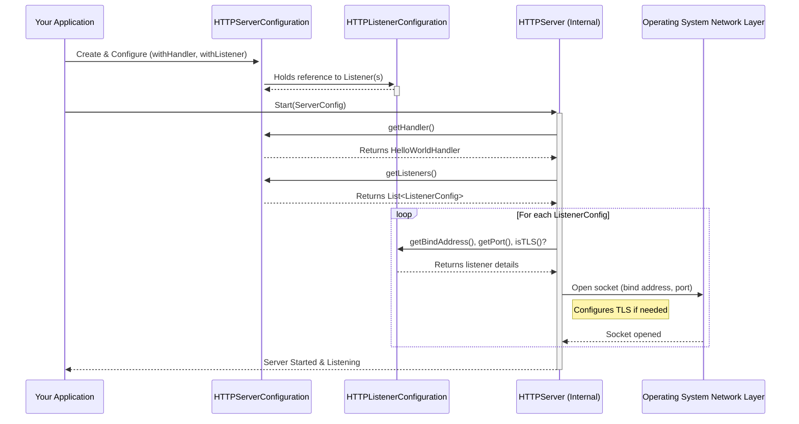

# Chapter 3: HTTPServerConfiguration & Listeners

Welcome back! In [Chapter 2: HTTPHandler](02_httphandler_.md), we learned how to create the "chef" (`HTTPHandler`) that processes incoming requests and prepares responses. But how do we tell our server which chef to use? And where should the server even set up shop to listen for customer orders (requests)?

Think about opening a restaurant: just having a great chef isn't enough. You need an address, a front door with a sign (port number), maybe security for VIP guests (HTTPS), and a manager who knows which chef is on duty. That's where `HTTPServerConfiguration` and `HTTPListenerConfiguration` come in.

## The Restaurant Blueprint: `HTTPServerConfiguration`

`HTTPServerConfiguration` acts like the **overall blueprint and management plan** for our server (restaurant). It holds important instructions that apply to the *entire* server, such as:

*   **The Main Chef:** Which `HTTPHandler` should handle incoming requests?
*   **Operating Rules:** Things like timeout limits (how long to wait for a slow client), buffer sizes (how much data to handle at once), and default behaviors (like whether to try compressing responses).
*   **The List of Entrances:** Where are the "front doors" located? This is managed using `HTTPListenerConfiguration` objects.

The most crucial part for now is telling the server which handler to use. We do this using the `withHandler` method.

Let's create a basic configuration and tell it to use the `HelloWorldHandler` we hypothetically created in the previous chapter:

```java
// Import necessary classes
import io.fusionauth.http.server.HTTPServerConfiguration;
// Assume HelloWorldHandler is defined as in Chapter 2
// import com.example.HelloWorldHandler;

// Create a new server configuration object
HTTPServerConfiguration serverConfig = new HTTPServerConfiguration();

// Tell the configuration which handler to use for all requests
// We need an actual instance of our handler class
serverConfig.withHandler(new HelloWorldHandler());

// serverConfig now knows to use HelloWorldHandler
```

This snippet creates a new `HTTPServerConfiguration` object and immediately tells it that our `HelloWorldHandler` instance is the designated "chef" for handling requests that come into this server.

This configuration object can hold many other settings (timeouts, buffer sizes, etc.), which you can explore in the `HTTPServerConfiguration.java` and `Configurable.java` files. For now, knowing how to set the handler is the most important step.

## The Front Doors: `HTTPListenerConfiguration`

A server needs at least one "front door" where clients can connect. In networking, a door is defined by a **network address** (like an IP address) and a **port number**. `HTTPListenerConfiguration` defines one such door.

Think of it like specifying an entrance to our restaurant:

*   **Address:** Which network interface should we listen on? (e.g., `localhost` only allows connections from the same machine, `0.0.0.0` listens on all available network interfaces).
*   **Port:** Which specific "door number" should clients knock on? (Common ports are 80 for HTTP and 443 for HTTPS, but we often use others like 8080 or 9000 during development).
*   **Security (TLS):** Should this door use HTTPS (secure, encrypted communication)? If yes, we need to provide the necessary security badges (TLS certificates and private keys).

A server can have *multiple* listeners. For example, it might listen on port 80 for regular HTTP traffic and port 443 for secure HTTPS traffic simultaneously.

Let's create a configuration for a simple listener that accepts regular HTTP connections on port 8080 on the local machine:

```java
// Import necessary classes
import io.fusionauth.http.server.HTTPListenerConfiguration;
import java.net.InetAddress;
import java.net.UnknownHostException;

try {
    // Get the address for 'localhost' (usually 127.0.0.1)
    InetAddress localhost = InetAddress.getByName("127.0.0.1");

    // Define a listener for HTTP (non-TLS) on localhost, port 8080
    HTTPListenerConfiguration httpListener = new HTTPListenerConfiguration(localhost, 8080);

    // httpListener is now configured for http://127.0.0.1:8080

} catch (UnknownHostException e) {
    System.err.println("Could not find localhost address!");
    // Handle the error appropriately
}
```

This code creates an `HTTPListenerConfiguration` specifying that the server should listen *only* on the `127.0.0.1` address (localhost) on port `8080`. Because we didn't provide any certificates or keys, this listener will handle plain HTTP traffic.

If we wanted to listen on *all* network interfaces (e.g., so others on our local network could connect), we could use a special constructor or address (like `0.0.0.0`). If we wanted HTTPS, we would use a different constructor that accepts certificate and private key information (found in `HTTPListenerConfiguration.java`).

```java
// --- Conceptual Example for HTTPS (TLS) ---
// Don't worry about getting real certs/keys yet!

// Hypothetical constructor for TLS
// HTTPListenerConfiguration httpsListener = new HTTPListenerConfiguration(
//     port,             // e.g., 8443
//     certificateChain, // Security certificate(s)
//     privateKey        // Matching private key
// );

// This listener would handle https://... connections
```

## Putting it all Together: Adding Listeners to the Server Config

Now we have a server blueprint (`HTTPServerConfiguration` specifying the handler) and a front door definition (`HTTPListenerConfiguration`). How do we tell the blueprint about the door?

The `HTTPServerConfiguration` has a method called `withListener` to add one or more listener configurations.

Let's combine our previous examples:

```java
import io.fusionauth.http.server.HTTPServerConfiguration;
import io.fusionauth.http.server.HTTPListenerConfiguration;
// Assume HelloWorldHandler is defined
// import com.example.HelloWorldHandler;
import java.net.InetAddress;
import java.net.UnknownHostException;

try {
    // 1. Configure the main server blueprint
    HTTPServerConfiguration serverConfig = new HTTPServerConfiguration()
        .withHandler(new HelloWorldHandler()); // Set our chef

    // 2. Configure the front door (listener)
    InetAddress localhost = InetAddress.getByName("127.0.0.1");
    HTTPListenerConfiguration httpListener = new HTTPListenerConfiguration(localhost, 8080);

    // 3. Add the listener to the server configuration
    serverConfig.withListener(httpListener);

    // Now serverConfig holds the plan:
    // - Use HelloWorldHandler for requests
    // - Listen on http://127.0.0.1:8080

} catch (UnknownHostException e) {
    System.err.println("Could not find localhost address!");
    // Handle error
}
```

Now, `serverConfig` contains all the essential information: which handler to use and where to listen for connections. We can even add multiple listeners:

```java
// ... (previous setup for serverConfig and httpListener) ...

// CONCEPTUAL: Add a second listener for HTTPS on port 8443
// Assume we have certificateChain and privateKey variables properly loaded
// HTTPListenerConfiguration httpsListener = new HTTPListenerConfiguration(
//     InetAddress.getByName("0.0.0.0"), // Listen on all interfaces
//     8443,
//     certificateChain,
//     privateKey
// );
// serverConfig.withListener(httpsListener); // Add the second listener

// Now serverConfig would represent a server listening on:
// - http://127.0.0.1:8080 (using HelloWorldHandler)
// - https://<any-ip>:8443 (also using HelloWorldHandler)
```

## How the Server Uses This Configuration (Under the Hood)

You've created the blueprint, but how does the actual [HTTPServer](04_httpserver_.md) (which we'll meet properly in the next chapter) use it?

When you start the `HTTPServer`, you give it this `HTTPServerConfiguration` object. Here's a simplified view of what it does:

1.  **Read Blueprint:** The `HTTPServer` looks at the `HTTPServerConfiguration`.
2.  **Assign Handler:** It notes down which `HTTPHandler` instance it should use (e.g., our `HelloWorldHandler`).
3.  **Setup Listeners:** It iterates through the list of `HTTPListenerConfiguration` objects.
4.  **Open Doors:** For each listener config, it opens a network socket on the specified bind address and port.
5.  **Configure Security:** If a listener is marked for TLS (HTTPS), the server sets up the encryption using the provided certificates and keys.
6.  **Ready for Connections:** The server is now ready to accept incoming connections on all configured listeners. When a connection arrives, it will eventually pass the resulting `HTTPRequest` to the designated `HTTPHandler`.

Here's a diagram showing the server startup phase:



This diagram shows that the `HTTPServer` uses the `HTTPServerConfiguration` object you provide to figure out *how* (the handler) and *where* (the listeners) it should operate.

The actual Java classes involved are:
*   `main/java/io/fusionauth/http/server/HTTPServerConfiguration.java`
*   `main/java/io/fusionauth/http/server/HTTPListenerConfiguration.java`
*   `main/java/io/fusionauth/http/server/Configurable.java` (provides the `with...` methods)

## Conclusion

You've learned how to create the essential blueprints for our HTTP server:

*   `HTTPServerConfiguration`: Defines global server settings, most importantly the main `HTTPHandler` to use.
*   `HTTPListenerConfiguration`: Defines a specific network "front door" (bind address, port, and optional TLS settings).
*   The `HTTPServerConfiguration` holds a list of `HTTPListenerConfiguration` objects, allowing the server to listen on multiple addresses/ports.

These configuration objects tell the server *how* to behave and *where* to listen. Without them, the server wouldn't know which handler code to run or how to accept connections from clients.

Now that we know how to configure the server, we're ready to see the server itself in action!

Let's move on to the next chapter: [HTTPServer](04_httpserver_.md), where we'll learn how to actually start, run, and stop the server using the configuration we just created.

---

Generated by [AI Codebase Knowledge Builder](https://github.com/The-Pocket/Tutorial-Codebase-Knowledge)