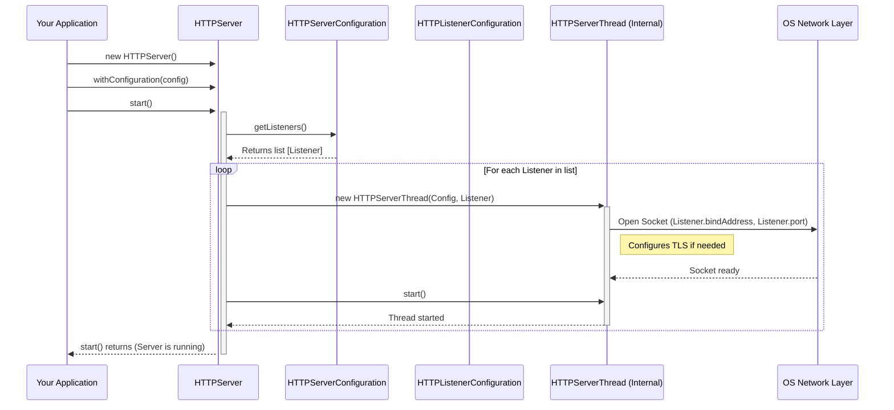

# Chapter 4: HTTPServer

Welcome back! In [Chapter 3: HTTPServerConfiguration & Listeners](03_httpserverconfiguration___listeners_.md), we learned how to create the blueprint (`HTTPServerConfiguration`) and define the front doors (`HTTPListenerConfiguration`) for our web server restaurant. We specified the address, port, security settings, and even designated our "chef" ([HTTPHandler](02_httphandler_.md)).

But a blueprint and a designated chef don't magically open a restaurant! We need someone to take that blueprint, actually build the restaurant at the specified address, open the doors, hire the staff, manage the day-to-day operations, and eventually close up shop. This is the role of the `HTTPServer`.

## The Restaurant Manager: What is `HTTPServer`?

Think of the `HTTPServer` as the **Restaurant Manager**. It's the main engine that brings everything together and makes the web server actually run.

Its key responsibilities are:

1.  **Setup:** Takes the `HTTPServerConfiguration` (the blueprint) you provide.
2.  **Build & Open:** Sets up the actual network listeners ("opens the doors") based on the `HTTPListenerConfiguration` definitions. This includes handling security (TLS/HTTPS) if configured.
3.  **Hire Staff:** Prepares the system to handle incoming requests, often by setting up worker threads (which we'll see in [HTTP Worker & Server Thread](05_http_worker___server_thread_.md)).
4.  **Oversee Operations:** Manages the lifecycle – it starts the listening process and keeps it running.
5.  **Shutdown:** Provides a way to cleanly stop the server, closing the listeners and stopping the workers.

Without the `HTTPServer`, the configuration and handlers are just inactive code. The `HTTPServer` is the object that breathes life into them.

## Use Case: Starting Our "Hello World" Server

Let's revisit the configuration we built in Chapter 3. We had a `serverConfig` object that knew about our `HelloWorldHandler` and was told to listen on `http://127.0.0.1:8080`. How do we use `HTTPServer` to actually start this server?

1.  **Create the Manager:** Instantiate the `HTTPServer` class.
2.  **Give it the Blueprint:** Tell the `HTTPServer` to use our `serverConfig`.
3.  **Start the Server:** Call the `start()` method.
4.  **(Later) Stop the Server:** Call the `close()` method when we're done.

Here's how that looks in code:

```java
import io.fusionauth.http.server.HTTPServer;
import io.fusionauth.http.server.HTTPServerConfiguration;
import io.fusionauth.http.server.HTTPListenerConfiguration;
// Assume HelloWorldHandler is defined as in Chapter 2
// import com.example.HelloWorldHandler;
import java.net.InetAddress;

public class SimpleServer {

    public static void main(String[] args) {
        HTTPServer server = null;
        try {
            // --- Configuration from Chapter 3 ---
            HTTPServerConfiguration serverConfig = new HTTPServerConfiguration()
                .withHandler(new HelloWorldHandler()); // Our chef

            InetAddress localhost = InetAddress.getByName("127.0.0.1");
            HTTPListenerConfiguration listenerConfig = new HTTPListenerConfiguration(localhost, 8080); // Door: 127.0.0.1:8080

            serverConfig.withListener(listenerConfig); // Add door to blueprint
            // --- End Configuration ---

            // 1. Create the Server (Restaurant Manager)
            server = new HTTPServer();

            // 2. Give the Server its Configuration (Blueprint)
            server.withConfiguration(serverConfig);

            // 3. Start the Server (Open the restaurant!)
            System.out.println("Starting server on http://127.0.0.1:8080...");
            server.start();
            System.out.println("Server started!");

            // Keep the main thread alive (otherwise the program would exit immediately)
            // In a real application, this might wait for a shutdown signal.
            System.out.println("Press Enter to stop the server...");
            System.in.read();

        } catch (Exception e) {
            System.err.println("Server error: " + e.getMessage());
            e.printStackTrace();
        } finally {
            // 4. Stop the Server (Close the restaurant)
            if (server != null) {
                System.out.println("Stopping server...");
                server.close();
                System.out.println("Server stopped.");
            }
        }
    }
}
```

Let's break down the key `HTTPServer` parts:

1.  `server = new HTTPServer();`: We create an instance of the `HTTPServer`. It's now ready to be configured.
2.  `server.withConfiguration(serverConfig);`: We pass the `HTTPServerConfiguration` object (which contains our handler and listener info) to the server. Now the manager has the blueprints.
3.  `server.start();`: This is the magic button! The `HTTPServer` reads the configuration, sets up the listener on port 8080, prepares the internal machinery, and starts accepting connections. Your program will *not* block here; the server runs in the background (on other threads). That's why we need the `System.in.read()` to keep the main program alive.
4.  `server.close();`: When we want to stop (e.g., after pressing Enter), we call `close()`. This tells the server to stop accepting new connections, wait for ongoing requests to finish (up to a configured timeout), and clean up resources. Using a `finally` block ensures `close()` is called even if errors occur.

If you ran this code, you could open a web browser and navigate to `http://127.0.0.1:8080`, and you would see "Hello, World!" served by your `HelloWorldHandler`.

## Under the Hood: What Happens During `start()` and `close()`?

You don't *need* to know the internal details to use the server, but understanding the basics helps.

**When `start()` is called:**

1.  **Read Config:** The `HTTPServer` looks at the `HTTPServerConfiguration` it was given.
2.  **Initialize Context:** It creates an `HTTPContext` (a place to potentially share information across requests, though not used in our simple example).
3.  **Loop Through Listeners:** It gets the list of `HTTPListenerConfiguration` objects from the main configuration.
4.  **Create Server Threads:** For *each* listener configuration, it creates an internal helper object, often a dedicated thread (like `HTTPServerThread` in this project). This thread is responsible *only* for that specific listener (e.g., port 8080).
5.  **Open Socket:** The `HTTPServerThread` opens a network socket on the specified bind address and port (e.g., `127.0.0.1:8080`). It configures TLS/HTTPS if required by the listener config.
6.  **Start Listening Thread:** The `HTTPServerThread` is started. It begins actively listening for incoming client connections on its socket.
7.  **Return:** The `start()` method returns control to your code almost immediately. The actual listening happens on the background threads.

Here's a simplified view of the startup sequence:



**When `close()` is called:**

1.  **Signal Shutdown:** The `HTTPServer` tells each of its internal `HTTPServerThread` objects to shut down gracefully.
2.  **Stop Accepting:** Each `HTTPServerThread` stops accepting *new* incoming connections on its socket.
3.  **Wait for Workers:** The server might wait for currently active worker threads (handling ongoing requests) to complete, up to a specified `shutdownDuration` from the configuration. (More on workers in the [next chapter](05_http_worker___server_thread_.md)).
4.  **Close Sockets:** The network sockets are closed.
5.  **Stop Threads:** The internal server threads (`HTTPServerThread`) stop executing.
6.  **Cleanup:** Resources are released.

## Diving Deeper: Code Snippets (Simplified)

Let's peek inside `main/java/io/fusionauth/http/server/HTTPServer.java` (simplified for clarity).

**Inside `start()`:**

```java
// Simplified from main/java/io/fusionauth/http/server/HTTPServer.java

public HTTPServer start() {
    // ... (logging, context setup omitted) ...

    try {
        // Get the list of listeners from the configuration
        for (HTTPListenerConfiguration listener : configuration.getListeners()) {
            // Create a dedicated thread for this listener
            HTTPServerThread serverThread = new HTTPServerThread(configuration, listener);
            servers.add(serverThread); // Keep track of the thread

            // Start the background thread. This thread will open the socket
            // and start listening for connections.
            serverThread.start();
            logger.info("HTTP server listening on port [{}]", listener.getPort());
        }
        logger.info("HTTP server started successfully");
    } catch (Exception e) {
        // ... (error handling and cleanup omitted) ...
    }

    return this; // Return immediately, server runs in background
}
```
This shows the loop creating and starting an `HTTPServerThread` for each listener defined in the configuration. The actual socket opening happens *inside* the `HTTPServerThread`.

**Inside `close()`:**

```java
// Simplified from main/java/io/fusionauth/http/server/HTTPServer.java

@Override
public void close() {
    logger.info("HTTP server shutdown requested.");
    long shutdownMillis = configuration.getShutdownDuration().toMillis();

    // 1. Tell all server threads to begin shutting down
    for (HTTPServerThread thread : servers) {
        thread.shutdown(); // Signal the thread to stop
    }

    // 2. Wait for each thread to finish (up to the timeout)
    for (Thread thread : servers) {
        try {
            thread.join(shutdownMillis); // Wait for thread completion
        } catch (InterruptedException e) { /* Ignore */ }
        // ... (check elapsed time omitted) ...
    }

    logger.info("HTTP server shutdown successfully.");
}
```
This demonstrates the two-phase shutdown: first, signal all threads (`thread.shutdown()`), then wait for them to finish (`thread.join()`).

## Conclusion

You've now met the `HTTPServer` - the main engine or "Restaurant Manager" of our web server. It's the component that takes the `HTTPServerConfiguration` blueprint and makes the server operational.

You learned:

*   The `HTTPServer` orchestrates the entire server lifecycle.
*   You configure it using `withConfiguration()`, passing the setup defined in [Chapter 3: HTTPServerConfiguration & Listeners](03_httpserverconfiguration___listeners_.md).
*   `start()` brings the server online, opening listeners and preparing to handle requests using background threads.
*   `close()` performs a graceful shutdown, closing listeners and stopping threads.

The `HTTPServer` sets up the stage, but who actually handles each customer (client request) that walks through the door? The manager (`HTTPServer`) delegates this to dedicated staff.

Let's move on to the next chapter to meet the workforce: [HTTP Worker & Server Thread](05_http_worker___server_thread_.md), and see how individual connections and requests are handled.

---

Generated by [AI Codebase Knowledge Builder](https://github.com/The-Pocket/Tutorial-Codebase-Knowledge)