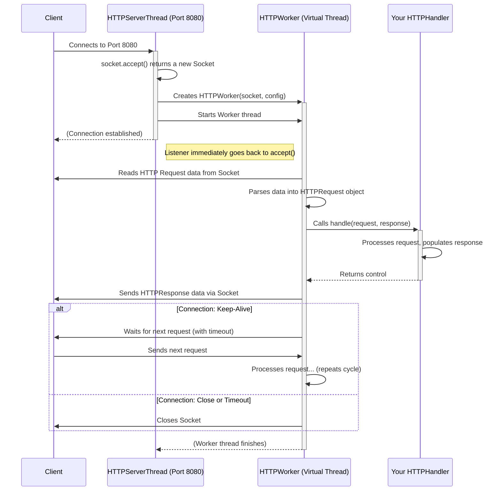

# Chapter 5: HTTP Worker & Server Thread

Welcome back! In [Chapter 4: HTTPServer](04_httpserver_.md), we learned how the `HTTPServer` acts like the Restaurant Manager, taking our configuration blueprint and opening the restaurant for business by starting the listeners. But the manager doesn't personally serve every single customer! How does the server handle potentially hundreds or thousands of clients connecting at the same time?

That's where the internal workforce comes in: the `HTTPServerThread` and the `HTTPWorker`. They are the unsung heroes working behind the scenes to manage each connection efficiently.

## The Receptionist and the Waiter: What are `HTTPServerThread` and `HTTPWorker`?

Imagine our restaurant again. It might have multiple entrances (listeners), like a main door (port 80) and a VIP entrance (port 443 for HTTPS).

*   **`HTTPServerThread`**: Think of this as the **Head Receptionist** assigned to *one specific entrance* (a specific listener configured in [HTTPServerConfiguration & Listeners](03_httpserverconfiguration___listeners_.md)). Their only job is to stand at that door and greet new customers as they arrive (`accept` incoming network connections, represented by `Socket` objects). As soon as a customer arrives, the Receptionist immediately hands them off to a dedicated Waiter (`HTTPWorker`) and goes back to watching the door for the next arrival. They don't take orders or handle the details.

*   **`HTTPWorker`**: This is like the **Dedicated Waiter** assigned to *one specific customer* (a single `Socket` connection) for the duration of their visit (or until they leave). The Waiter runs off (in its own dedicated, lightweight *virtual thread*) to handle everything for that customer:
    1.  Listens to the customer's order (reads the raw HTTP request data).
    2.  Writes the order down neatly ([HTTPRequest & HTTPResponse](01_httprequest___httpresponse_.md)).
    3.  Takes the order ticket to the chef ([HTTPHandler](02_httphandler_.md)).
    4.  Waits for the chef to prepare the meal (the handler populates the `HTTPResponse`).
    5.  Brings the prepared meal back to the customer (sends the `HTTPResponse` data back over the network).
    6.  Asks if the customer needs anything else (handles "Keep-Alive" logic). If yes, waits for their next request. If no, cleans the table (closes the connection).

This division of labor allows the server to be highly efficient:
*   The `HTTPServerThread` (Receptionist) focuses solely on accepting new connections quickly.
*   Many `HTTPWorker` instances (Waiters) can run concurrently, each handling a different client, without blocking each other or the receptionist.

## How a Connection is Handled: The Flow

Let's trace the journey of a single client connecting to our server:

1.  **Server Starts:** Your application starts the [HTTPServer](04_httpserver_.md).
2.  **Receptionist Assigned:** The `HTTPServer` creates and starts an `HTTPServerThread` for each listener configured (e.g., one for port 8080).
3.  **Receptionist Waits:** The `HTTPServerThread` starts listening on its assigned port (e.g., 8080) for incoming connections. It blocks, waiting patiently (`socket.accept()`).
4.  **Client Connects:** Your web browser connects to `http://yourserver:8080`.
5.  **Receptionist Acts:** The `HTTPServerThread`'s `accept()` call returns, providing a `Socket` object representing this specific connection to the browser.
6.  **Waiter Assigned:** The `HTTPServerThread` immediately creates a new `HTTPWorker`, giving it the `Socket` and the server's configuration details.
7.  **Waiter Starts Work:** The `HTTPServerThread` starts the `HTTPWorker` on a new virtual thread. The `HTTPServerThread` immediately goes back to step 3, waiting for the *next* client.
8.  **Waiter Handles Request:** The `HTTPWorker` now owns the `Socket`. It:
    *   Reads the request data from the socket ([HTTP I/O Streams (Input & Output)](06_http_i_o_streams__input___output__.md)).
    *   Parses it into an `HTTPRequest` object.
    *   Creates an empty `HTTPResponse` object.
    *   Calls *your* application's `HTTPHandler.handle(request, response)`.
    *   Your handler does its work and populates the `response`.
    *   The worker takes the populated `response` and sends it back over the socket.
9.  **Keep-Alive or Close:**
    *   If the request indicated "Connection: Keep-Alive" (and the server agrees), the `HTTPWorker` keeps the `Socket` open and waits for *another* request from the *same client* (with a timeout). If another request comes, it repeats step 8.
    *   If the request indicated "Connection: Close", or if the keep-alive timeout expires, the `HTTPWorker` closes the `Socket`. The virtual thread for this worker then finishes.

This process allows the server to handle many clients concurrently because each client gets its own `HTTPWorker` running independently.

## Under the Hood: A Peek Inside

Let's visualize the interaction between the client, the listener thread, and the worker:



This shows how the `HTTPServerThread` delegates the actual request handling to the `HTTPWorker`.

### Code Glimpse: `HTTPServerThread` Accepting Connections

Inside `main/java/io/fusionauth/http/server/internal/HTTPServerThread.java`, the `run()` method contains the core loop for accepting connections (simplified):

```java
// Simplified from HTTPServerThread.java run() method

public class HTTPServerThread extends Thread {
    // ... fields like ServerSocket socket, configuration ...

    @Override
    public void run() {
        running = true;
        // ... cleaner thread start omitted ...

        while (running) {
            try {
                // 1. Wait for a new client connection
                //    This line blocks until a client connects
                Socket clientSocket = socket.accept();

                // 2. Set initial timeout for reading the request
                clientSocket.setSoTimeout((int) configuration.getInitialReadTimeoutDuration().toMillis());
                logger.debug("Accepted inbound connection...");

                // 3. Create the specific worker for this connection
                Throughput throughput = new Throughput(/*...*/); // For tracking data speed
                HTTPWorker runnable = new HTTPWorker(clientSocket, configuration, instrumenter, listener, throughput);

                // 4. Start the worker on a lightweight virtual thread
                Thread client = Thread.ofVirtual()
                                      .name("HTTP client [" + clientSocket.getRemoteSocketAddress() + "]")
                                      .start(runnable); // Start the worker!

                // Keep track of the client (for cleanup, omitted)
                // clients.add(new ClientInfo(client, runnable, throughput));

            } catch (SocketException e) {
                // Handle shutdown or errors...
                running = false; // Example: stop if socket is closed
            } catch (IOException e) {
                // Handle common I/O errors during accept...
            } catch (Throwable t) {
                // Handle unexpected errors...
                break; // Example: exit loop on fatal error
            }
            // Loop immediately back to socket.accept() for the next client
        }

        // Cleanup when loop exits (omitted)
    }

    // ... other methods like shutdown() ...
}
```

This code shows the continuous loop where the `HTTPServerThread` accepts a connection, creates a worker (`HTTPWorker`), starts it in a virtual thread, and then immediately loops back to accept the next connection.

### Code Glimpse: `HTTPWorker` Handling a Connection

Inside `main/java/io/fusionauth/http/server/internal/HTTPWorker.java`, the `run()` method handles the lifecycle of a single client connection (simplified):

```java
// Simplified from HTTPWorker.java run() method

public class HTTPWorker implements Runnable {
    // ... fields like Socket socket, configuration, handler ...
    private volatile State state; // Tracks worker state (Read, Write, etc.)

    @Override
    public void run() {
        boolean keepAlive = false;
        try {
            // Loop to handle multiple requests if Keep-Alive is used
            while (true) {
                state = State.Read; // We are now trying to read

                // 1. Create request/response objects for THIS request
                var request = new HTTPRequest(/*...*/);
                var response = new HTTPResponse();

                // Setup Input/Output Streams (See Chapter 6)
                var inputStream = new ThroughputInputStream(socket.getInputStream(), throughput);
                var bodyBytes = HTTPTools.parseRequestPreamble(inputStream, request, /*...*/); // Read headers etc.
                var httpInputStream = new HTTPInputStream(/*...*/);
                request.setInputStream(httpInputStream);

                var outputStream = new HTTPOutputStream(/*...*/);
                response.setOutputStream(outputStream);

                // (Handle "Expect: 100-continue" omitted)

                // 2. Determine Keep-Alive based on request headers
                keepAlive = request.isKeepAlive();
                response.setHeader(Headers.Connection, keepAlive ? Connections.KeepAlive : Connections.Close);

                // 3. Call the application's handler!
                logger.debug("Calling the handler.");
                state = State.Process; // Now processing
                var handler = configuration.getHandler();
                handler.handle(request, response); // YOUR CODE RUNS HERE!
                response.close(); // Ensure response is finalized (writes data)
                logger.debug("Handler completed successfully.");

                // 4. Check if connection should remain open
                if (!keepAlive) {
                    logger.debug("Closing because no Keep-Alive.");
                    break; // Exit the loop, connection will close in finally block
                }

                // 5. Keep-Alive: Prepare for the next request
                logger.debug("Keeping things alive.");
                state = State.KeepAlive;
                socket.setSoTimeout((int) configuration.getKeepAliveTimeoutDuration().toMillis()); // Set idle timeout
                httpInputStream.purge(); // Discard any unread request body bytes
                // Loop back to the top for the next request on this connection
            }
        } catch (SocketTimeoutException | ConnectionClosedException e) {
            // Handle timeouts (e.g., Keep-Alive idle timeout)
            logger.debug("Closing due to timeout or closed connection.");
        } catch (ParseException pe) {
            // Handle bad requests from client
            logger.debug("Closing due to bad request.");
        } catch (IOException io) {
            // Handle network errors during read/write
            logger.debug("Closing due to IO exception.", io);
        } catch (Throwable t) {
            // Handle unexpected errors in handler or framework
            logger.error("HTTP worker error.", t);
            // Try to send a 500 error if possible (omitted)
        } finally {
            // 6. Ensure the socket is closed when done or on error
            closeSocket(); // Helper method to close the socket
            logger.debug("Worker thread finished.");
        }
    }

    private void closeSocket() {
        try {
            socket.close();
        } catch (IOException e) { /* Log and ignore */ }
    }

    // ... other methods and State enum ...
}
```

This highlights the worker's loop: reading a request, calling the handler, sending the response, and either looping for keep-alive or exiting to close the connection.

## Conclusion

You've met the internal workforce of the `src` HTTP server:

*   `HTTPServerThread`: The efficient **Receptionist** for a specific listener port, solely focused on accepting new client connections (`Socket` objects).
*   `HTTPWorker`: The dedicated **Waiter** that handles *everything* for a single client connection in its own virtual thread – reading, parsing, calling the handler, writing the response, and managing keep-alive.

This separation of concerns allows the server to handle many concurrent connections effectively. The `HTTPServerThread` quickly accepts new clients, while numerous `HTTPWorker` instances process their requests in parallel.

Now that we understand who handles the connection, how do they actually read the request data and write the response data over the network socket? That's the job of the I/O streams.

Let's move on to the next chapter: [HTTP I/O Streams (Input & Output)](06_http_i_o_streams__input___output__.md) to understand how data flows between the worker and the client.

---

Generated by [AI Codebase Knowledge Builder](https://github.com/The-Pocket/Tutorial-Codebase-Knowledge)