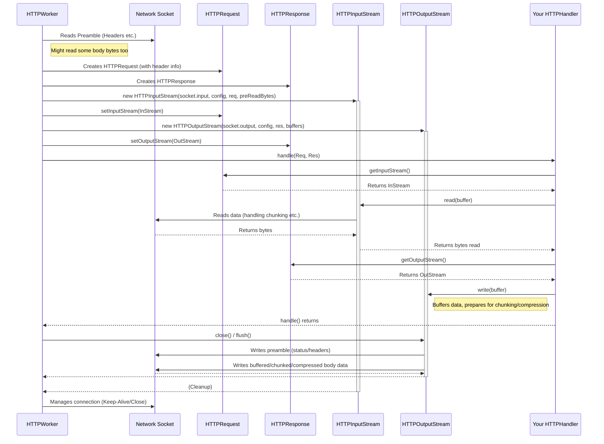

# Chapter 6: HTTP I/O Streams (Input & Output)

Welcome back! In [Chapter 5: HTTP Worker & Server Thread](05_http_worker___server_thread_.md), we saw how the `HTTPServerThread` acts as a receptionist, passing each new client connection (`Socket`) to a dedicated `HTTPWorker` (the waiter). We know the `HTTPWorker` gets the request, asks the `HTTPHandler` (the chef) to prepare the response, and sends it back.

But *how* exactly does the worker read the raw order details (request bytes) from the client and send the finished meal (response bytes) back? Network communication happens as a flow of raw bytes. We need a way to manage this flow according to HTTP rules, without making our `HTTPHandler` deal with the messy low-level details.

That's where **HTTP I/O Streams** come in!

## The Smart Plumbing: What are HTTP I/O Streams?

Think of the network connection (`Socket`) between the client and the server as a basic pipe. Data flows through it as raw bytes. However, HTTP has specific rules about *how* that data should be structured, especially for request and response bodies.

*   Sometimes the data comes in chunks (`Transfer-Encoding: chunked`).
*   Sometimes the data is compressed (`Content-Encoding: gzip`).
*   Sometimes you don't know the total size beforehand.
*   Sometimes you're dealing with file uploads (`multipart/form-data`).

Handling all these variations directly inside your application logic (`HTTPHandler`) would be complicated and repetitive. Instead, the `src` server provides specialized stream classes that act like **smart plumbing** or **specialized conveyor belts** built on top of the basic network pipe:

*   `HTTPInputStream`: This is the **incoming pipe/belt**. It's used by the `HTTPWorker` (and potentially your `HTTPHandler`) to *read* the body of an `HTTPRequest`. It intelligently handles complexities like chunked encoding, making it seem like you're just reading a simple stream of data.
*   `HTTPOutputStream`: This is the **outgoing pipe/belt**. It's used by your `HTTPHandler` to *write* the body of an `HTTPResponse`. It manages buffering (collecting data before sending), can automatically apply chunked encoding if the response length isn't known beforehand, and can even handle compression (like GZIP) if requested and supported by the client.

These stream classes hide the low-level HTTP data transfer details, allowing your handler to focus purely on the application logic.

## Key Stream Classes

1.  **`HTTPInputStream`**:
    *   **Purpose:** Read the request body data sent by the client.
    *   **Where:** Accessed via `request.getInputStream()` within your `HTTPHandler`.
    *   **Features:** Handles reading from the underlying network socket, potentially decodes chunked data automatically, accounts for bytes already read during header parsing.

2.  **`HTTPOutputStream`**:
    *   **Purpose:** Write the response body data back to the client.
    *   **Where:** Accessed via `response.getOutputStream()` within your `HTTPHandler`.
    *   **Features:** Buffers output for efficiency, automatically applies chunked encoding if `Content-Length` isn't set, can integrate with compression streams (like `GZIPOutputStream`), writes the HTTP response preamble (status line, headers) just before sending the body.

3.  **Specialized Streams:**
    *   `ChunkedInputStream` / `ChunkedOutputStream`: Internal helpers used by the main HTTP streams to specifically handle the chunked transfer encoding format. You usually don't interact with these directly.
    *   `MultipartStream`: A helper class used internally (or potentially directly if needed) to parse `multipart/form-data` requests, which are commonly used for file uploads. It breaks the incoming stream into individual parts (form fields and files). We saw its output (`FileInfo`) in [Chapter 1: HTTPRequest & HTTPResponse](01_httprequest___httpresponse_.md).
    *   `GZIPOutputStream` / `DeflaterOutputStream` (Standard Java Classes): Used *by* `HTTPOutputStream` to compress data when needed.

## Use Case: Echoing Request Body

Let's imagine we want to create a simple handler that reads whatever the client sends in the request body and just sends it straight back (an "echo" server).

Here's how the `HTTPHandler` would use the I/O streams:

```java
import io.fusionauth.http.server.HTTPHandler;
import io.fusionauth.http.server.HTTPRequest;
import io.fusionauth.http.server.HTTPResponse;
import java.io.InputStream;
import java.io.OutputStream;

public class EchoHandler implements HTTPHandler {

    @Override
    public void handle(HTTPRequest request, HTTPResponse response) throws Exception {
        // 1. Check if the client sent any data (optional but good practice)
        Long contentLength = request.getContentLength();
        boolean isChunked = request.isChunked();

        if ((contentLength == null || contentLength == 0) && !isChunked) {
            response.setStatus(200); // OK, but nothing to echo
            response.setHeader("Content-Type", "text/plain");
            try (OutputStream output = response.getOutputStream()) {
                output.write("You didn't send any data to echo!".getBytes());
            }
            return;
        }

        // 2. Set response headers (before getting the output stream)
        //    We don't know the length, so the HTTPOutputStream will chunk it!
        response.setStatus(200);
        // Try to match the content type the client sent, or default
        String requestContentType = request.getContentType();
        response.setHeader("Content-Type", requestContentType != null ? requestContentType : "application/octet-stream");

        // 3. Use try-with-resources for automatic stream closing
        try (InputStream input = request.getInputStream();
             OutputStream output = response.getOutputStream()) {

            // 4. Read from input, write to output (the core logic)
            byte[] buffer = new byte[4096]; // A temporary buffer
            int bytesRead;
            while ((bytesRead = input.read(buffer)) != -1) {
                output.write(buffer, 0, bytesRead);
            }
        }
        // Streams are automatically closed here
    }
}
```

Let's break this down:

1.  **Check Input:** We check if the request actually has a body using `getContentLength()` and `isChunked()`.
2.  **Set Headers:** We set the success status (200) and the `Content-Type`. Notice we *don't* set `Content-Length` because we're streaming the echo – we don't know the total size upfront. `HTTPOutputStream` will see this and automatically use chunked encoding for the response.
3.  **Get Streams:** We get the `InputStream` from the `request` and the `OutputStream` from the `response`. Using `try-with-resources` ensures they are properly managed and closed, even if errors occur.
4.  **The Loop:** This is standard Java I/O:
    *   `input.read(buffer)`: Reads a chunk of bytes from the `HTTPInputStream` into our temporary `buffer`. This might involve reading from the network, decoding chunked data, etc., but our handler doesn't need to know! It just gets the body bytes.
    *   `output.write(buffer, 0, bytesRead)`: Writes the chunk we just read into the `HTTPOutputStream`. This might involve buffering, compressing, or chunking the data before it actually goes out over the network, but again, our handler just writes.
    *   The loop continues until `input.read` returns `-1`, indicating the end of the request body stream.

This handler elegantly reads and writes data without worrying about the underlying HTTP protocol specifics, thanks to the abstraction provided by `HTTPInputStream` and `HTTPOutputStream`.

## Under the Hood: How Streams Interact with the Worker

The `HTTPWorker` we met in [Chapter 5: HTTP Worker & Server Thread](05_http_worker___server_thread_.md) is the one that sets up these streams.

Here's a simplified flow when a request arrives:

1.  **Worker Gets Socket:** The `HTTPWorker` receives the raw network `Socket` from the `HTTPServerThread`.
2.  **Read Preamble:** The worker reads the *initial* part of the request (method, path, headers) directly from the socket's input stream. Some body bytes might accidentally be read along with the headers if they arrived in the same network packet.
3.  **Create `HTTPRequest`:** The worker parses the preamble and creates the `HTTPRequest` object.
4.  **Setup `HTTPInputStream`:** The worker creates an `HTTPInputStream`. This stream is given:
    *   The socket's original input stream.
    *   Any body bytes that were already read during preamble parsing.
    *   Information from the `HTTPRequest` (like `Content-Length` or if it's chunked).
    *   The server configuration.
5.  **Setup `HTTPOutputStream`:** The worker creates an `HTTPOutputStream`. This stream is given:
    *   The socket's original output stream.
    *   A reference to the `HTTPResponse` object (so it can read headers like `Content-Type` or `Content-Length` when it's time to write).
    *   Information about client capabilities (like `Accept-Encoding`).
    *   The server configuration (e.g., buffer sizes, compression settings).
6.  **Link to Request/Response:** The worker sets the `HTTPInputStream` on the `HTTPRequest` (`request.setInputStream(...)`) and the `HTTPOutputStream` on the `HTTPResponse` (`response.setOutputStream(...)`).
7.  **Call Handler:** The worker calls your `HTTPHandler.handle(request, response)`.
8.  **Handler Uses Streams:** Your handler calls `request.getInputStream()` and `response.getOutputStream()` to get these pre-configured, intelligent streams.
9.  **Worker Finalizes:** After the handler returns, the `HTTPWorker` ensures the `HTTPOutputStream` is properly flushed and closed, which triggers sending the final response data (including the end-of-chunks marker if needed).



### Code Glimpse: `HTTPInputStream` Initialization

Looking inside `main/java/io/fusionauth/http/server/io/HTTPInputStream.java`, we see how it's set up to potentially handle chunking based on the request headers.

```java
// Simplified concept from HTTPInputStream constructor and commit method

public class HTTPInputStream extends InputStream {
    // ... fields: request, delegate (socket input), bodyBytes (pre-read), config ...
    private boolean committed = false;
    private InputStream actualInputStream; // Will be socket stream or ChunkedInputStream

    public HTTPInputStream(HTTPServerConfiguration configuration, HTTPRequest request,
                           InputStream delegate, byte[] bodyBytes) {
        this.request = request;
        this.delegate = delegate; // Raw socket input stream
        this.bodyBytes = bodyBytes; // Bytes read during header parsing
        // ... store config, logger, instrumenter ...
        if (request.getContentLength() != null) {
            this.bytesRemaining = request.getContentLength();
        }
    }

    // Called internally before the first read
    private void commit() {
        if (committed) return;
        committed = true;

        actualInputStream = delegate; // Start with the raw stream

        // If chunked, wrap the raw stream with a ChunkedInputStream
        if (request.isChunked()) {
            logger.trace("Handling body using chunked encoding.");
            // The ChunkedInputStream also needs the pre-read bytes
            actualInputStream = new ChunkedInputStream(delegate, 1024, bodyBytes);
            bodyBytes = null; // ChunkedInputStream now manages pre-read bytes
            // ... instrumentation ...
        } else if (request.getContentLength() == null || request.getContentLength() == 0) {
            // No body expected
            actualInputStream = InputStream.nullInputStream();
        }
        // Otherwise, just use the raw delegate stream for Content-Length reads
    }

    @Override
    public int read(byte[] buffer, int offset, int length) throws IOException {
        if (!committed) {
            commit(); // Sets up actualInputStream (e.g., Chunked or raw)
        }

        // Read from pre-read buffer first if available
        if (bodyBytes != null) {
             // ... logic to read from bodyBytes ...
        } else {
            // Read from the actualInputStream (could be raw socket or ChunkedInputStream)
            int read = actualInputStream.read(buffer, offset, length);
            // ... update bytesRemaining if using Content-Length ...
            return read;
        }
        // ... handle bytesRemaining for Content-Length ...
    }
    // ... other read methods ...
}
```

This shows that `HTTPInputStream` delays deciding exactly *how* to read (raw vs. chunked) until the first `read()` call. It wraps the original socket stream (`delegate`) with a `ChunkedInputStream` only if necessary.

### Code Glimpse: `HTTPOutputStream` Initialization

Similarly, `main/java/io/fusionauth/http/server/io/HTTPOutputStream.java` delays setting up compression or chunking until the first `write()` call.

```java
// Simplified concept from HTTPOutputStream constructor and commit method

public class HTTPOutputStream extends OutputStream {
    // ... fields: response, delegate (socket output), config, buffers ...
    private OutputStream finalDelegate; // Will be socket stream or wrapped (Chunked/GZIP)
    private ServerToSocketOutputStream bufferWrapper; // Handles buffering before finalDelegate
    private boolean committed = false;
    private boolean compress; // From config or set explicitly

    public HTTPOutputStream(HTTPServerConfiguration configuration, /*...,*/
                           HTTPResponse response, OutputStream delegate, /*...,*/) {
        this.response = response;
        this.compress = configuration.isCompressByDefault();
        // Initial delegate is a buffering wrapper around the raw socket output
        this.bufferWrapper = new ServerToSocketOutputStream(delegate, buffers, /*...*/);
        this.finalDelegate = bufferWrapper; // Start with just the buffer
        // ... store other fields ...
    }

    // Called internally before the first write or explicit flush/close
    private void commit(boolean closing) throws IOException {
        if (committed) return;
        committed = true;

        boolean chunked = false;
        boolean gzip = false;
        // ... logic to check response status (e.g., 204 No Content) ...

        // Determine chunking/compression based on response headers and config
        if (closing && response.getContentLength() == null /* and not 204 */) {
            response.setContentLength(0L); // Empty body if closing with no writes
        } else {
             if (compress /* and client accepts gzip/deflate and not 204 */) {
                // Set Content-Encoding header, remove Content-Length
                response.setHeader(Headers.ContentEncoding, ContentEncodings.Gzip); // Example
                response.removeHeader(Headers.ContentLength);
                gzip = true;
             }
             if (response.getContentLength() == null /* and not 204 */) {
                response.setHeader(Headers.TransferEncoding, TransferEncodings.Chunked);
                chunked = true;
             }
        }

        // Write the status line and headers FIRST, using the buffering wrapper
        HTTPTools.writeResponsePreamble(response, bufferWrapper);

        // Now, wrap the buffering stream if chunking or compression is needed
        OutputStream current = bufferWrapper;
        if (chunked) {
            current = new ChunkedOutputStream(current, buffers.chunkBuffer(), /*...*/);
        }
        if (gzip) {
            current = new GZIPOutputStream(current, true);
        }
        // ... handle deflate ...

        this.finalDelegate = current; // This is what write() will use now

         // If closing immediately after commit (e.g., empty body), close the final delegate chain
        if (closing) {
           finalDelegate.close();
        }
    }

    @Override
    public void write(int b) throws IOException {
        if (!committed) {
            commit(false); // Setup streams, write preamble
        }
        finalDelegate.write(b); // Write to the (potentially wrapped) stream
    }

    @Override
    public void close() throws IOException {
        if (!committed) {
            commit(true); // Ensure preamble is written, even for empty bodies
        } else {
            finalDelegate.close(); // Close the chain (flushes Chunked/GZIP etc.)
        }
    }
    // ... other write methods, flush ...
}
```

This illustrates the "commit" step where `HTTPOutputStream` finalizes the response headers based on whether `Content-Length` was set or if compression is enabled, writes the preamble, and then potentially wraps the underlying stream with `ChunkedOutputStream` or `GZIPOutputStream` before user data is written through it.

## Conclusion

You've learned about the crucial role of **HTTP I/O Streams** (`HTTPInputStream` and `HTTPOutputStream`) in the `src` server:

*   They act as **smart abstractions** over the raw network socket streams.
*   `HTTPInputStream` simplifies **reading** request bodies by handling complexities like chunked decoding transparently.
*   `HTTPOutputStream` simplifies **writing** response bodies by managing buffering, chunking (if no `Content-Length` is set), and compression.
*   They allow your [HTTPHandler](02_httphandler_.md) to focus on application logic rather than low-level HTTP data transfer details.
*   They are set up by the [HTTP Worker & Server Thread](05_http_worker___server_thread_.md) and made available via the [HTTPRequest & HTTPResponse](01_httprequest___httpresponse_.md) objects.

These streams are the bridge between the high-level request/response objects and the low-level byte shuffling over the network.

Now that we've seen how data flows, let's look at some helper classes and constants that make working with HTTP easier.

Let's move on to the next chapter: [HTTP Utilities & Constants](07_http_utilities___constants_.md).

---

Generated by [AI Codebase Knowledge Builder](https://github.com/The-Pocket/Tutorial-Codebase-Knowledge)