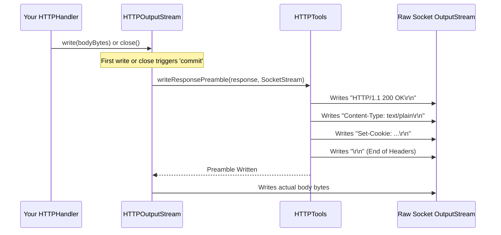

# Chapter 7: HTTP Utilities & Constants

Welcome back! In [Chapter 6: HTTP I/O Streams (Input & Output)](06_http_i_o_streams__input___output__.md), we learned how the `HTTPInputStream` and `HTTPOutputStream` act like smart pipes, helping us read request data and write response data without getting tangled in low-level HTTP details like chunked encoding.

Now, imagine you're building something complex, like a web server. You'll find yourself needing the same tools and standard ingredients repeatedly. For instance, you always need to end lines in HTTP headers with a specific sequence (`\r\n`), you need to know the standard names for headers (`Content-Type`, `Host`), and you often perform common tasks like parsing values from headers.

Wouldn't it be helpful to have a shared toolkit and pantry for these common items? That's exactly what the HTTP Utilities & Constants provide in the `src` project!

## The Kitchen Toolkit: Constants and Helpers

When cooking, you have:
1.  **A Spice Rack & Cookbook (`HTTPValues`)**: Contains standard, unchanging ingredients and definitions (like salt, pepper, standard measurements, common recipe names like "GET" or "POST").
2.  **Utility Gadgets (`HTTPTools`)**: A set of handy tools for specific, common tasks (like a peeler for potatoes, a can opener for beans, a knife for chopping).

In our server:

*   `HTTPValues`: This class (and related ones like `HTTPMethod`) is our **shared spice rack and cookbook**. It holds standard constant values defined by the HTTP protocol. This includes things like:
    *   Standard header names (`Content-Type`, `Content-Length`, `Set-Cookie`)
    *   Standard HTTP methods (`GET`, `POST`, `PUT`)
    *   Common header values (`keep-alive`, `chunked`, `application/json`)
    *   Essential control characters (like the `\r\n` line ending, stored as bytes).
    *   Standard status code definitions (though the numbers themselves are often used directly).

*   `HTTPTools`: This class is our set of **kitchen utility gadgets**. It provides helper functions (`static` methods) for common tasks that you might need to perform when dealing with HTTP messages, such as:
    *   Parsing header values that have parameters (e.g., `text/html; charset=utf-8`).
    *   Decoding data sent in URLs or forms (`?name=John%20Doe`).
    *   Writing the initial part of an HTTP response (the status line like `HTTP/1.1 200 OK` and the headers) correctly.

Using these utilities helps in several ways:
*   **Consistency:** Ensures everyone uses the exact same standard values.
*   **Reduces Typos:** Avoids errors from misspelling "Content-Length" or forgetting a `\r`.
*   **Less Repetitive Code:** Prevents rewriting the same parsing logic in multiple places.

## `HTTPValues`: The Spice Rack & Cookbook

Let's look at how you might use `HTTPValues` in your [HTTPHandler](02_httphandler_.md). Imagine you want to send back a plain text response. You need to set the `Content-Type` header correctly.

Instead of typing the string `"Content-Type"` and `"text/plain"`, you can use the predefined constants:

```java
import io.fusionauth.http.HTTPValues; // Import the constants
import io.fusionauth.http.server.HTTPHandler;
import io.fusionauth.http.server.HTTPRequest;
import io.fusionauth.http.server.HTTPResponse;
import java.io.OutputStream;
import java.nio.charset.StandardCharsets;

public class PlainTextHandler implements HTTPHandler {
    @Override
    public void handle(HTTPRequest request, HTTPResponse response) throws Exception {
        response.setStatus(200); // Standard status code (integer)

        // Use constants from HTTPValues for header name and value
        response.setHeader(HTTPValues.Headers.ContentType, HTTPValues.ContentTypes.Text);

        // Get the output stream (as seen in Chapter 6)
        try (OutputStream output = response.getOutputStream()) {
            byte[] body = "This is plain text.".getBytes(StandardCharsets.UTF_8);
            // Set Content-Length using the constant name
            response.setHeader(HTTPValues.Headers.ContentLength, String.valueOf(body.length));
            output.write(body);
        }
    }
}
```

In this code:
*   `HTTPValues.Headers.ContentType` provides the standard string `"Content-Type"`.
*   `HTTPValues.ContentTypes.Text` provides the standard string `"text/plain"`.
*   `HTTPValues.Headers.ContentLength` provides `"Content-Length"`.

By using these constants, your code is clearer, less prone to typos, and adheres strictly to HTTP standards. `HTTPValues` contains many nested classes for different categories like `Headers`, `ContentTypes`, `Methods`, `ControlBytes`, etc.

You'll also find standard HTTP method definitions in `HTTPMethod`, which internally often refers to constants in `HTTPValues`:

```java
import io.fusionauth.http.HTTPMethod; // For standard method objects

// Example check within a handler:
if (request.getMethod().is(HTTPMethod.GET)) {
    // Handle GET request...
} else if (request.getMethod().is(HTTPMethod.POST)) {
    // Handle POST request...
}
```

## `HTTPTools`: The Kitchen Gadgets

Now, let's look at `HTTPTools`. These are helper functions for common operations.

**Use Case: Parsing a Header Parameter**

Sometimes headers contain extra information after a semicolon. For example, the `Content-Type` header might specify a character set: `application/json; charset=utf-8`. If you needed to extract the main value (`application/json`) and the parameters (`charset=utf-8`), `HTTPTools` can help.

```java
import io.fusionauth.http.util.HTTPTools;
import io.fusionauth.http.util.HTTPTools.HeaderValue; // The result type
import java.util.Map;

// Example: Assume 'contentTypeHeaderValue' holds "application/json; charset=utf-8"
String contentTypeHeaderValue = "application/json; charset=utf-8";

// Use the tool to parse it
HeaderValue parsed = HTTPTools.parseHeaderValue(contentTypeHeaderValue);

// Extract the parts
String mainValue = parsed.value(); // Will be "application/json"
Map<String, String> parameters = parsed.parameters(); // Map containing {"charset": "utf-8"}

System.out.println("Main Type: " + mainValue);
System.out.println("Charset: " + parameters.get("charset"));
```

This `parseHeaderValue` gadget saves you from writing complex string-splitting and trimming logic yourself.

**Use Case: Writing the Response Preamble (Internal)**

Remember how the [HTTP I/O Streams (Input & Output)](06_http_i_o_streams__input___output__.md) handle sending the response? The `HTTPOutputStream` needs to write the status line (`HTTP/1.1 200 OK`) and all the headers before writing the body. It uses a helper function from `HTTPTools` called `writeResponsePreamble` to do this correctly.

You typically don't call this directly; the `HTTPOutputStream` calls it for you automatically when you start writing to it or close it. But it's a key utility provided by `HTTPTools`.

```java
// Conceptual: Inside HTTPOutputStream's logic (you don't write this)

// ... when commit() is called before writing the body ...
HTTPTools.writeResponsePreamble(response, underlyingOutputStream);
// ... now write the actual body bytes ...
```

This tool ensures the status line and headers are formatted perfectly according to HTTP rules, using constants like `HTTPValues.ControlBytes.CRLF` for line endings.

## Under the Hood

Let's peek inside these utility classes.

**`HTTPValues`:**

This is primarily a collection of constant definitions. There's no complex logic here, just carefully defined standard strings and byte arrays.

```java
// Simplified snippet from main/java/io/fusionauth/http/HTTPValues.java

public final class HTTPValues {
    private HTTPValues() { } // Cannot be instantiated

    // Example: Nested class for Header names
    public static final class Headers {
        public static final String ContentLength = "Content-Length";
        public static final String ContentType = "Content-Type";
        public static final String Host = "Host";
        public static final String SetCookie = "Set-Cookie";
        // ... many more headers ...
        private Headers() { }
    }

    // Example: Nested class for Content Types
    public static final class ContentTypes {
        public static final String ApplicationJson = "application/json";
        public static final String Form = "application/x-www-form-urlencoded";
        public static final String Text = "text/plain";
        // ... more content types ...
        private ContentTypes() { }
    }

    // Example: Nested class for Control Bytes
    public static final class ControlBytes {
        public static final byte CR = '\r';
        public static final byte LF = '\n';
        public static final byte[] CRLF = {CR, LF}; // The crucial line ending
        // ... other control byte sequences ...
        private ControlBytes() { }
    }

    // ... other nested classes like Methods, Status, etc. ...
}
```

It's straightforward – just a well-organized library of standard HTTP terms.

**`HTTPTools`:**

This class contains `static` methods that perform specific tasks. Let's look conceptually at `writeResponsePreamble`.

**Simplified Steps for `writeResponsePreamble`:**

1.  Get the status code (e.g., `200`) and status message (e.g., `"OK"`) from the `HTTPResponse` object.
2.  Write the protocol string (`HTTP/1.1`, using `HTTPValues.Protocols.HTTTP1_1`).
3.  Write a space.
4.  Write the status code.
5.  Write a space.
6.  Write the status message.
7.  Write the standard line ending (`\r\n`, using `HTTPValues.ControlBytes.CRLF`).
8.  Loop through all headers (except cookies) stored in the `HTTPResponse`.
9.  For each header: write the header name, a colon `:`, a space, the header value, and `\r\n`.
10. Loop through all cookies added to the `HTTPResponse`.
11. For each cookie: write `Set-Cookie: `, the formatted cookie string, and `\r\n`.
12. Write one final `\r\n` to indicate the end of the headers.

Here's a diagram showing `HTTPOutputStream` using this tool:



And a simplified code snippet showing the core idea:

```java
// Simplified concept from main/java/io/fusionauth/http/util/HTTPTools.java

public final class HTTPTools {

    public static void writeResponsePreamble(HTTPResponse response, OutputStream outputStream) throws IOException {
        // 1. Write Status Line (calls private helper writeStatusLine)
        writeStatusLine(response, outputStream);

        // 2. Write Headers (excluding cookies)
        for (var entry : response.getHeadersMap().entrySet()) {
            String name = entry.getKey();
            for (String value : entry.getValue()) {
                outputStream.write(name.getBytes());
                outputStream.write(':');
                outputStream.write(' ');
                outputStream.write(value.getBytes());
                outputStream.write(HTTPValues.ControlBytes.CRLF); // Use constant
            }
        }

        // 3. Write Cookies
        for (var cookie : response.getCookies()) {
            outputStream.write(HTTPValues.HeaderBytes.SetCookie); // Use constant
            outputStream.write(':');
            outputStream.write(' ');
            outputStream.write(cookie.toResponseHeader().getBytes()); // Format cookie
            outputStream.write(HTTPValues.ControlBytes.CRLF); // Use constant
        }

        // 4. Write final CRLF
        outputStream.write(HTTPValues.ControlBytes.CRLF);
    }

    // Private helper for just the status line
    private static void writeStatusLine(HTTPResponse response, OutputStream out) throws IOException {
        out.write(HTTPValues.ProtocolBytes.HTTTP1_1); // Use constant
        out.write(' ');
        out.write(Integer.toString(response.getStatus()).getBytes());
        out.write(' ');
        if (response.getStatusMessage() != null) {
            out.write(response.getStatusMessage().getBytes());
        }
        out.write(HTTPValues.ControlBytes.CRLF); // Use constant
    }

    // ... other tools like parseHeaderValue, parseEncodedData ...
}
```

This shows how `HTTPTools` uses constants from `HTTPValues` to correctly perform common HTTP operations.

## Conclusion

You've learned about the essential toolkit provided by `HTTPValues` and `HTTPTools`:

*   `HTTPValues`: Your **shared spice rack and cookbook**, providing standard constants for HTTP headers, methods, content types, and control characters (`\r\n`). Ensures consistency and reduces errors.
*   `HTTPTools`: Your set of **kitchen utility gadgets**, offering static helper methods for common tasks like parsing header parameters and writing the response preamble. Reduces repetitive code.

These utilities work behind the scenes and are available for your use, making interaction with the HTTP protocol safer and easier within the `src` server framework. They embody the principle of "Don't Repeat Yourself" (DRY) for common HTTP standards and operations.

We've now covered most of the core mechanics of handling requests and responses. But what if we want to observe what the server is doing, measure performance, or add custom logging? That's where instrumentation comes in.

Let's move on to the final core chapter: [Instrumenter](08_instrumenter_.md).

---

Generated by [AI Codebase Knowledge Builder](https://github.com/The-Pocket/Tutorial-Codebase-Knowledge)