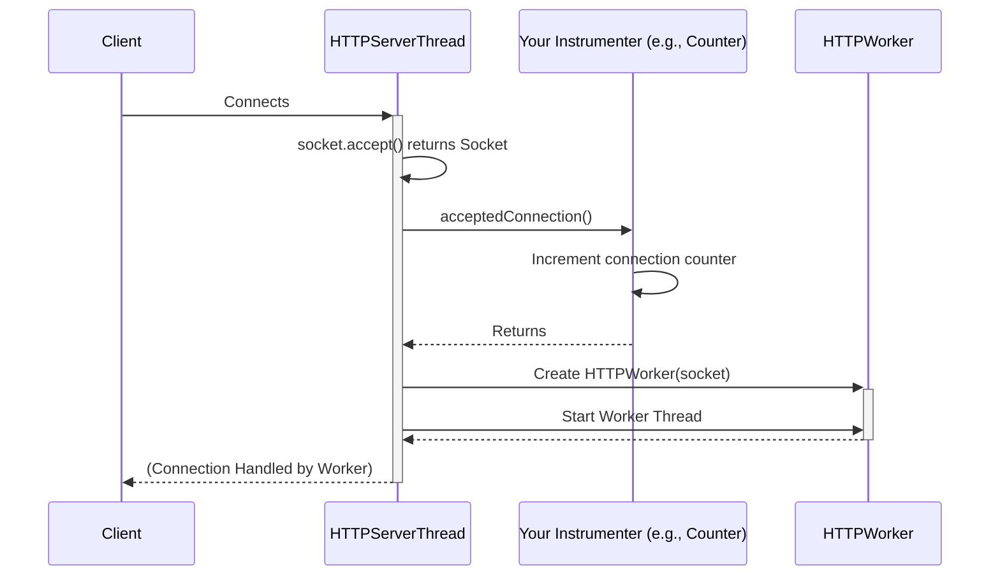

# Chapter 8: Instrumenter

Welcome to the final core chapter! In [Chapter 7: HTTP Utilities & Constants](07_http_utilities___constants_.md), we saw how helpful tools and standard values make building HTTP applications easier and more reliable. We've now covered how requests (`HTTPRequest`) and responses (`HTTPResponse`) are defined, how your application logic (`HTTPHandler`) handles them, how the server is configured (`HTTPServerConfiguration`, `HTTPListenerConfiguration`), how it runs (`HTTPServer`), how it manages connections (`HTTPServerThread`, `HTTPWorker`), and how data flows (`HTTPInputStream`, `HTTPOutputStream`).

But how do we know if our server is running well? Is it handling many connections? Are there errors? Is it using a lot of resources?

## The Restaurant Dashboard: Why Monitor?

Imagine running a busy restaurant. You wouldn't just hope everything is okay! You'd want a **dashboard** showing key information:
*   How many customers walked in today?
*   How many orders were served?
*   Were there any complaints or problems (like dropped trays)?
*   How busy are the waiters right now?

This dashboard helps you understand performance, spot problems early, and make decisions (like hiring more staff if it's always busy).

In the world of web servers, we need a similar dashboard. We need a way to **monitor** the server's health and performance without adding lots of messy `System.out.println` statements or logging code directly inside our core server logic (like the `HTTPHandler`).

This is where the `Instrumenter` comes in. It provides a clean way to "observe" what the server is doing.

## What is `Instrumenter`? The Observer Contract

`Instrumenter` is a Java **interface**. Remember, an interface is like a contract – it defines *what* can be done, but not *how*. The `Instrumenter` interface defines a set of methods that the `HTTPServer` will call when specific events happen.

Think of it as a **list of events the server promises to announce**:
*   "Hey, I just accepted a new connection!" (`acceptedConnection()`)
*   "Oops, a client sent a really badly formatted request." (`badRequest()`)
*   "Just read some bytes from the client." (`readFromClient(bytes)`)
*   "Just sent some bytes back to the client." (`wroteToClient(bytes)`)
*   "A worker thread just started." (`threadStarted()`)
*   "A worker thread just finished." (`threadExited()`)
*   "The server just started up!" (`serverStarted()`)
*   ...and a few others.

Here's a simplified look at the interface:

```java
// Simplified from main/java/io/fusionauth/http/server/Instrumenter.java
public interface Instrumenter {
  // Called when a new connection is accepted
  void acceptedConnection();

  // Called when a badly formed request is received
  void badRequest();

  // Called when bytes are read from the network
  void readFromClient(long bytes);

  // Called when bytes are written to the network
  void wroteToClient(long bytes);

  // Called when a worker (virtual thread) starts
  void threadStarted();

  // Called when a worker (virtual thread) exits
  void threadExited();

  // Called when the server starts
  void serverStarted();

  // ... other methods like chunkedRequest(), chunkedResponse(), connectionClosed() ...
}
```

Your job, if you want to monitor the server, is to provide a class that *implements* this `Instrumenter` interface. Your implementation decides what to *do* when the server announces these events (e.g., increment a counter, log a message, send data to a monitoring system).

## Example Implementation: `CountingInstrumenter`

The `src` project comes with a simple implementation called `CountingInstrumenter`. Its job is just to **count** how many times each event happens. It's like having simple tally counters on our restaurant dashboard.

```java
// Simplified from main/java/io/fusionauth/http/server/CountingInstrumenter.java
public class CountingInstrumenter implements Instrumenter {
  // Counters for different events
  private long connections;
  private long badRequests;
  private long bytesRead;
  private long bytesWritten;
  private long threadCount;
  // ... other counters ...

  @Override
  public void acceptedConnection() {
    connections++; // Increment the counter
  }

  @Override
  public void badRequest() {
    badRequests++; // Increment the counter
  }

  @Override
  public void readFromClient(long bytes) {
    bytesRead += bytes; // Add to the total bytes read
  }

  @Override
  public void wroteToClient(long bytes) {
    bytesWritten += bytes; // Add to the total bytes written
  }

  @Override
  public void threadStarted() {
    threadCount++; // Increment active thread count
  }

  @Override
  public void threadExited() {
    threadCount--; // Decrement active thread count
  }

  // ... implementations for other methods ...

  // Methods to GET the current counts
  public long getConnections() { return connections; }
  public long getBytesRead() { return bytesRead; }
  public long getThreadCount() { return threadCount; }
  // ... getters for other counters ...
}
```

This class implements each method from the `Instrumenter` interface. When the server calls, for example, `acceptedConnection()`, the `CountingInstrumenter` simply increments its internal `connections` counter. It also provides `get...()` methods so other parts of your application can ask for the current counts (e.g., to display them on an admin page or log them periodically).

*(Note: There's also a `ThreadSafeCountingInstrumenter` which does the same thing but uses special atomic counters to be safe when multiple threads update counts simultaneously. `CountingInstrumenter` might be slightly faster but less accurate under very high load).*

## How to Use an `Instrumenter`

So you have an `Instrumenter` implementation (like `CountingInstrumenter`), how do you tell the server to use it?

You attach it to the [HTTPServerConfiguration](03_httpserverconfiguration___listeners_.md) *before* you start the server. The configuration object has a `withInstrumenter` method:

```java
import io.fusionauth.http.server.HTTPServer;
import io.fusionauth.http.server.HTTPServerConfiguration;
import io.fusionauth.http.server.HTTPListenerConfiguration;
import io.fusionauth.http.server.CountingInstrumenter; // Import the counter
// Assume HelloWorldHandler is defined
// import com.example.HelloWorldHandler;
import java.net.InetAddress;

public class MonitoredServer {

    public static void main(String[] args) {
        // 1. Create our instrumenter instance
        CountingInstrumenter counter = new CountingInstrumenter();

        HTTPServer server = null;
        try {
            // 2. Configure the server, including the instrumenter
            HTTPServerConfiguration serverConfig = new HTTPServerConfiguration()
                .withHandler(new HelloWorldHandler())
                .withInstrumenter(counter); // <-- Attach the instrumenter here!

            // ... add listener configuration ...
            InetAddress localhost = InetAddress.getByName("127.0.0.1");
            HTTPListenerConfiguration listenerConfig = new HTTPListenerConfiguration(localhost, 8080);
            serverConfig.withListener(listenerConfig);

            // 3. Start the server
            server = new HTTPServer().withConfiguration(serverConfig);
            server.start();
            System.out.println("Server started with monitoring!");

            // 4. Periodically check the counters (example)
            for (int i = 0; i < 5; i++) {
                Thread.sleep(10000); // Wait 10 seconds
                System.out.println("Connections accepted: " + counter.getConnections());
                System.out.println("Bytes read: " + counter.getBytesRead());
                System.out.println("Active threads: " + counter.getThreadCount());
            }

        } catch (Exception e) {
            e.printStackTrace();
        } finally {
            if (server != null) {
                server.close();
            }
        }
    }
}
```

1.  We create an instance of `CountingInstrumenter`.
2.  When creating the `HTTPServerConfiguration`, we chain a call to `.withInstrumenter(counter)`, passing our instance.
3.  We start the server as usual. The server now knows about our `counter` instance.
4.  (Example) We add a loop in our `main` method to periodically call the `get...()` methods on our `counter` instance to print the current statistics.

Now, as the server runs and accepts connections, handles requests, reads/writes data, etc., it will automatically call the corresponding methods on our `counter` instance, updating the counts behind the scenes. Our application logic (`HelloWorldHandler`) remains completely clean of any monitoring code!

## Under the Hood: When Does the Server Call the `Instrumenter`?

The `HTTPServer` and its internal components ([HTTP Worker & Server Thread](05_http_worker___server_thread_.md), [HTTP I/O Streams (Input & Output)](06_http_i_o_streams__input___output__.md)) are designed to call the configured `Instrumenter` at specific points in their lifecycle.

**Simplified Flow for an Accepted Connection:**

1.  The `HTTPServerThread` (Receptionist) is waiting for a connection (`socket.accept()`).
2.  A client connects. `accept()` returns a `Socket`.
3.  The `HTTPServerThread` checks if an `Instrumenter` is configured.
4.  If yes, it calls `instrumenter.acceptedConnection()`.
5.  *Then*, it proceeds to create the `HTTPWorker` (Waiter) for this connection.

Here's a sequence diagram:



**Code Glimpse: Calling `instrumenter.acceptedConnection()`**

Inside `main/java/io/fusionauth/http/server/internal/HTTPServerThread.java` (simplified):

```java
// Simplified from HTTPServerThread.java run() method

public class HTTPServerThread extends Thread {
    private final Instrumenter instrumenter; // Passed in during construction
    // ... other fields: socket, configuration ...

    @Override
    public void run() {
        // ... setup ...
        while (running) {
            try {
                Socket clientSocket = socket.accept();

                // --> Call the instrumenter! <--
                if (instrumenter != null) {
                    instrumenter.acceptedConnection();
                }

                // ... set timeout ...
                // ... create HTTPWorker ...
                // ... start worker thread ...

            } catch (Exception e) {
                // ... error handling ...
            }
        }
        // ... cleanup ...
    }
}
```
You can see the check `if (instrumenter != null)` and the call `instrumenter.acceptedConnection()` happen right after a connection is accepted, before the worker is even created. Similar calls are sprinkled throughout the server code at relevant event points (like reading/writing bytes, starting/stopping threads).

## Conclusion

You've learned about the `Instrumenter` interface, the server's way of providing a **monitoring dashboard**.

*   It defines a **contract** for observing key server events (connections, reads, writes, errors, threads).
*   You provide an **implementation** (like `CountingInstrumenter`) to decide *what* to do when these events occur (e.g., count them).
*   You attach your instrumenter to the `HTTPServerConfiguration` using `.withInstrumenter()`.
*   This allows you to monitor the server's health and performance **without cluttering** your core application logic ([HTTPHandler](02_httphandler_.md)).
*   The server automatically calls your instrumenter's methods at the appropriate times.

The `Instrumenter` provides crucial visibility into the server's operations, helping with debugging, performance tuning, and understanding system behavior.

This chapter concludes our tour of the main conceptual building blocks of the `src` HTTP server project. You've seen how all the pieces, from request/response modeling to handling logic, configuration, execution, I/O, utilities, and instrumentation, fit together to create a functional HTTP server. You should now have a solid foundation to understand how the server works and how to use it effectively.

---

Generated by [AI Codebase Knowledge Builder](https://github.com/The-Pocket/Tutorial-Codebase-Knowledge)