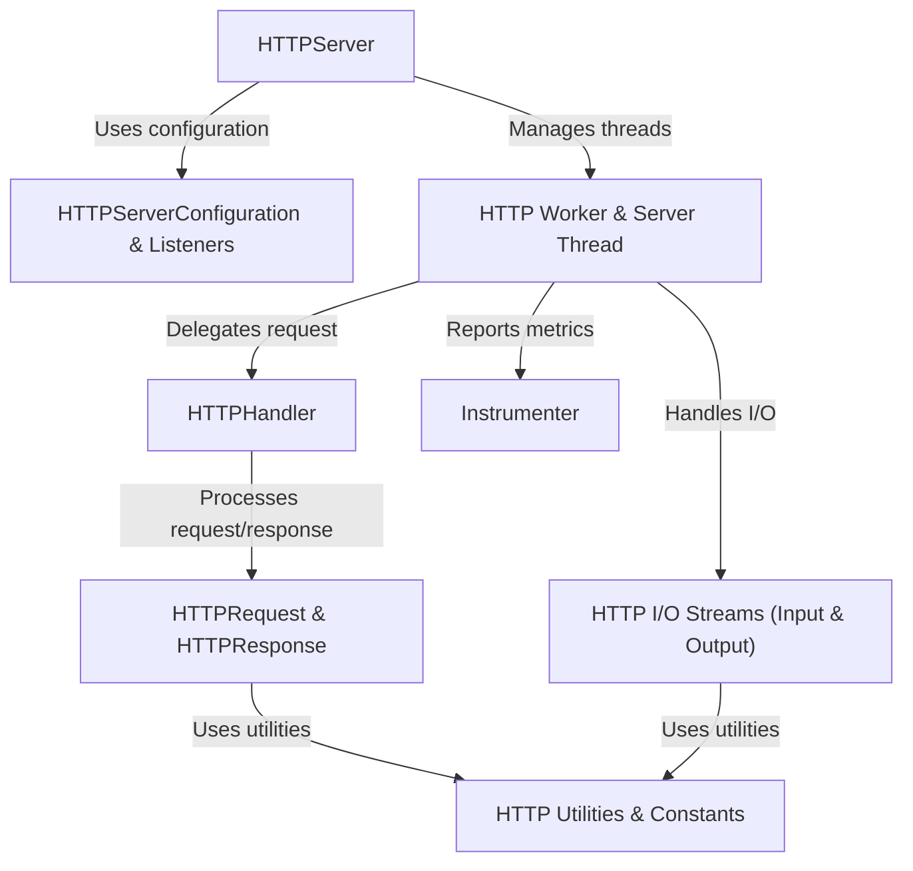

# Tutorial: src

This project provides the core components for building a **flexible** and **performant** HTTP/1.1 web server in Java.
It allows developers to define how *requests* are handled and *responses* are generated, managing the underlying network connections, data streams, and threading.
Think of it as a toolkit for creating custom web applications or services.

**Source Repository:** https://github.com/FusionAuth/java-http

## Chapters

1. [HTTPRequest & HTTPResponse
](01_httprequest___httpresponse_.md)
2. [HTTPHandler
](02_httphandler_.md)
3. [HTTPServerConfiguration & Listeners
](03_httpserverconfiguration___listeners_.md)
4. [HTTPServer
](04_httpserver_.md)
5. [HTTP Worker & Server Thread
](05_http_worker___server_thread_.md)
6. [HTTP I/O Streams (Input & Output)
](06_http_i_o_streams__input___output__.md)
7. [HTTP Utilities & Constants
](07_http_utilities___constants_.md)
8. [Instrumenter
](08_instrumenter_.md)

---

Generated by [AI Codebase Knowledge Builder](https://github.com/The-Pocket/Tutorial-Codebase-Knowledge)
